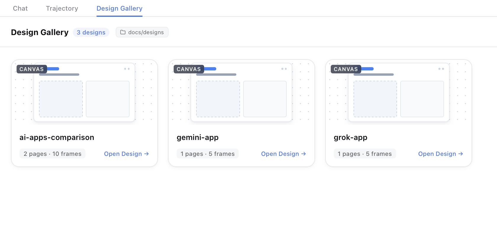
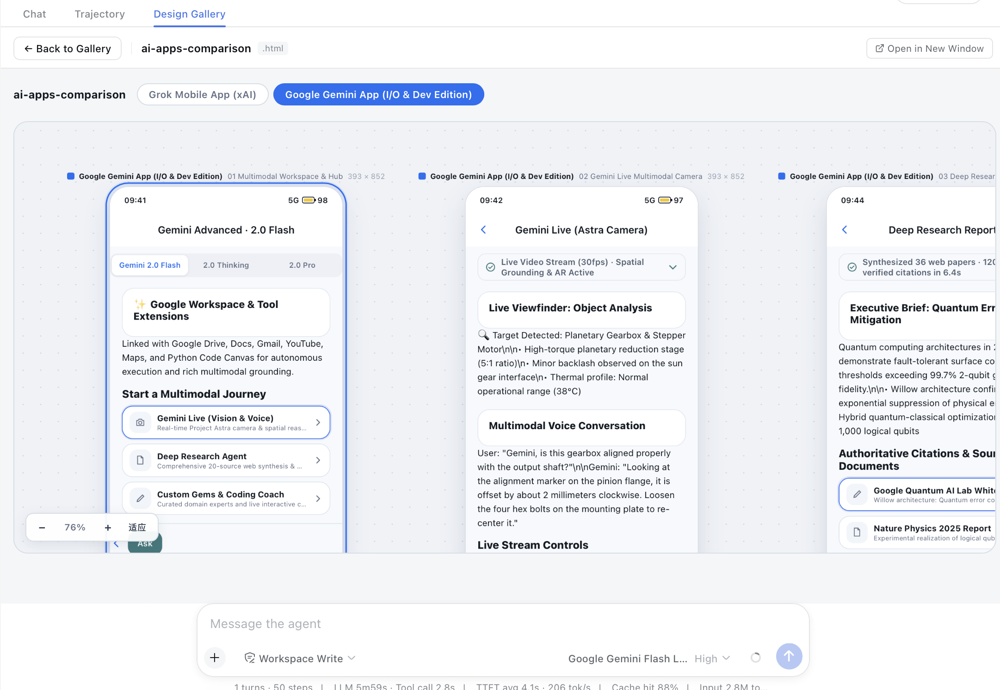
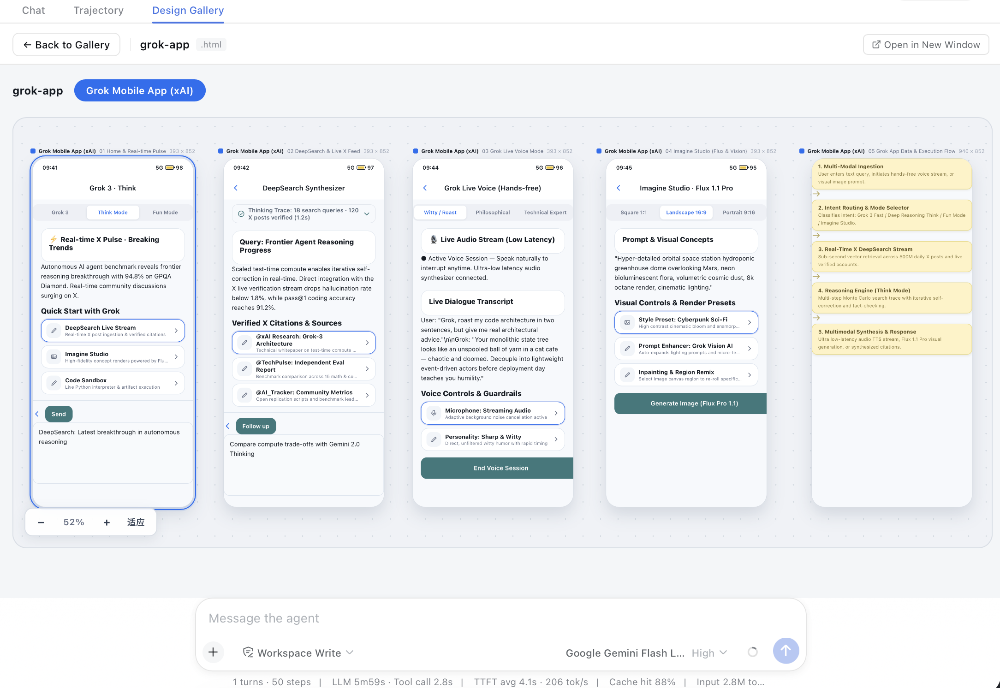

# Canvas Design Harness for DeepSeek Harness

[English](./README.md) | 简体中文

> 🎨 **DeepSeek Harness 的可视化画布设计插件与双规格 Skill 包。**
> 在 DeepSeek Harness Web GUI 中原生集成「设计大厅」多画板交互界面，同时支持在 Codex / Claude Code / 独立终端中作为通用 Skill 零依赖运行。

---

## 📸 效果预览

<details open>
  <summary><b>🖼️ 1. 设计大厅画廊 (Grid Overview)</b> — 集中浏览工作区下的所有设计文档</summary>
  <br/>
  <a href="./docs/assets/gallery-grid.png">
    
  </a>
</details>

<details open>
  <summary><b>🎨 2. 多画板交互画布 (Grok Mobile App)</b> — 无限缩放画板与多设备屏幕排版</summary>
  <br/>
  <a href="./docs/assets/canvas-viewer-grok.png">
    
  </a>
</details>

<details open>
  <summary><b>📊 3. 随代码版本控制的设计 Specs (AI Apps Comparison)</b> — 多页面设计文档直观对比</summary>
  <br/>
  <a href="./docs/assets/canvas-viewer-comparison.png">
    
  </a>
</details>

---

## 🌟 核心亮点

### 1. DeepSeek Harness 原生「设计大厅」UI
- 无缝挂载至 DSH 会话的 `conversation.view` 标签页环（与「对话」、「轨迹」并列）。
- 实时索引工作区 `docs/designs/` 目录下的所有设计稿，呈现精致卡片画廊。
- 内嵌全屏交互式画布查看器，支持多画板平移、缩放与实时热更新。

### 2. HTML 作为通用设计 Specs（对人类与 AI 双向友好）
- **人类友好**：设计稿存储为干净标准的单个 HTML 文件（`docs/designs/*.html`），无需任何专业设计软件，双击即可在任何浏览器中打开查看。
- **AI 友好**：基于语义化 DOM 结构，大模型（LLM）可精准解析、原子化生成、修改页面（Page）、画板（Frame）与组件（Component）。
- **Git 原生版本控制（Living Specs）**：设计文档作为产品需求与原型设计规范（Specs），与业务代码同仓存储，随 Git 分支一同提交、评审与演进。

### 3. 类 Figma 的多画板交互体验
- 支持多页面（Pages）与无限平移/缩放画布（Infinite Canvas）。
- 内置丰富的设备画板预设（手机、桌面、弹窗、流程图卡片等）。
- 内置零依赖轻量级 HTTP-MCP 守护进程（`127.0.0.1:9321`），支持原子级 MCP 批量修改与无浏览器 SVG 截图导出。

### 4. 双规格支持 (Dual-Spec)
- **DeepSeek Harness 插件**：通过 `dsh.bundle.patch` 与 `dsh.client` 实现前后端一体化加载。
- **Codex / Claude Code Skill**：引擎单例位于 `.agents/skills/canvas-design-harness/`，脱离 DSH 亦可独立运行。

---

## 🚀 快速上手

### 1. 安装为 DeepSeek Harness 插件

```sh
# 添加为 DSH 插件
dsh plugin --profile web add /path/to/dsh-canvas-design-harness

# 在普通终端重启 Web profile
python3 scripts/restart-web.py
```

刷新浏览器页面（`http://127.0.0.1:3080`），即可在会话右上角看到「**设计大厅**」Tab。

### 2. 对话即设计

1. **在对话中描述需求**：
   > *“帮我设计一个用户登录与注册界面的多画板设计稿”*
2. **AI 自动生成**：Agent 会自动调用 `canvas_harness_*` 工具在工作区 `docs/designs/` 目录下创建并排版设计稿。
3. **在设计大厅查看**：切换到「设计大厅」Tab，点击生成的卡片即可进入可视化画布进行预览。

---

## 🏗️ 仓库结构

```
dsh-canvas-design-harness/
├── .agents/skills/canvas-design-harness/   # 标准 Skill 引擎 (与 upstream 同步)
│   ├── SKILL.md       # 技能指令规范
│   ├── reference/     # 样式与交互脚本 (canvas-frames.css / canvas-frames.js)
│   ├── server/        # 零依赖 HTTP-MCP 守护进程 (端口 9321)
│   └── specs/         # 协议与能力规范
├── client/            # DSH Web 前端模块
│   ├── design-view.js # React 前端源码 (接入 DSH locale 与 Design System)
│   ├── bundle.js      # 构建后的 classic-script bundle
│   └── logic.js       # 纯逻辑与测试辅助
├── host/              # 宿主工具桥接
│   ├── tools.js       # 原生模型工具定义 (canvas_harness_*)
│   └── tools-entry.js # Cordis 工具注册入口
├── scripts/           # 构建、验收与维护工具
│   ├── build-client.mjs  # 客户端 bundle 打包脚本
│   ├── restart-web.py    # 宿主安全的守护化重启脚本
│   ├── verify-web.mjs    # 针对实时 GUI 的自动化验收脚本
│   └── sync-from-upstream.sh # 上游技能引擎同步脚本
├── docs/assets/       # 界面效果预览截图
├── plugin.js          # DSH 插件入口 (技能注册、daemon 调度、/canvas/* 路由)
├── package.json       # 插件清单 (声明 dsh.bundle.patch 与 dsh.client)
├── cordis.patch.yml   # Cordis profile 补丁声明
└── test/smoke.mjs     # 42 项离线集成测试套件 (Parts A~F)
```

---

## 🛠️ 宿主能力与模型工具

插件向 AI 模型注册了以下结构化工具（统一使用 `root` + `name` 寻址）：

| 工具名称 | 功能说明 | 对应 MCP 方法 |
|---|---|---|
| `canvas_harness_ensure_workspace` | 探测/启动守护进程并注册工作区 | `POST /workspaces` |
| `canvas_harness_list_designs` | 列出工作区目录下的所有设计稿 | `workspace.listFiles` |
| `canvas_harness_create_design` | 在工作区新建设计稿 HTML | `document.createFile` |
| `canvas_harness_get_document` | 读取并解析设计稿的节点树 | `document.getDocument` |
| `canvas_harness_batch` | 原子执行一组页面/画板/组件操作 | `batch` |
| `canvas_harness_validate` | 校验设计稿结构与规范 | `document.validate` |
| `canvas_harness_screenshot` | 无浏览器渲染为 SVG 图片 | `node.getScreenshot` |
| `canvas_harness_mcp_call` | 原始 MCP JSON-RPC 调用逃生口 | `tools/call` |

---

## 💻 开发者与验收指南

修改代码后，请按以下三步标准流程进行验收：

```sh
# 1. 重新构建客户端 Bundle
npm run build:client

# 2. 运行 42 项离线测试套件 (A 技能 / B 发现 / C 工具 / D 逻辑 / E 路由 / F 启动竞态)
node test/smoke.mjs

# 3. 对运行中的 Web GUI 运行实时验收
node scripts/verify-web.mjs
```

### 独立运行 Skill 引擎 (Codex / Claude Code)

本技能不强依赖 DSH，可直接在终端中独立启动守护进程：

```sh
cd .agents/skills/canvas-design-harness/server
node src/index.js <your-designs-folder>      # 默认监听 http://127.0.0.1:9321
```

---

## 📄 开源许可

[MIT License](LICENSE)
